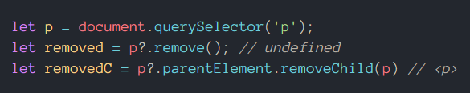

# #301DaysOfCode - Log
The daily log of my **#301DaysOfCode** challenge.

## Log

---
### Day 41: [12 Mar 2022]
**Today's progress:**
- Login/register lifecycle with NodeJS, round 1.

**Links:**
[Steve Griffith's tutorial on YouTube](https://youtu.be/KJdD8pdZSo8)

---
### Day 40: [11 Mar 2022]
**Today's progress:**
- Test sending/getting requests; ⚠ localhost != 127.0.0.1

---
### Day 39: [10 Mar 2022]
**Today's progress:**
- Basics on setting up a Node dev environment.

---
### Day 38: [09 Mar 2022]
**Today's progress:**
- Trying to understand why you can log FormData props but not the object itself.

---
### Day 37: [08 Mar 2022]
**Today's progress:**
- Client work

---
### Day 36: [07 Mar 2022]
**Today's progress:**
- Joomla recap

---
### Day 35: [06 Mar 2022]
**Today's progress:**
- Client work
- FormData objects
  
---
### Day 34: [05 Mar 2022]
**Today's progress:**
- Hosting and webmail config

---
### Day 33: [04 Mar 2022]
**Today's progress:**
- Review coding editors and tools

---
### Day 32: [03 Mar 2022]
**Today's progress:**
- Finish #CNC2022's challenge
- Client work

---
### Day 31: [02 Mar 2022]
**Today's progress:**
- Keep up with #CNC2022 mission 5 + I forgot to post on previous one :$

---
### Day 30: [01 Mar 2022]
**Today's progress:**
- Start #CNC2022 mission 5

---
### Day 29: [28 Feb 2022]
**Today's progress:**
- Review CSS positioning
  
---
### Day 28: [27 Feb 2022]
**Today's progress:**
- Trying to "debug" why a specific site is auto-refreshing on tab focus-unfocus when blocking trackers (ClickUp vs uBlock round 1!).

---
### Day 27: [26 Feb 2022]
**Today's progress:**
- Touch typing practice with [monkeytype](https://monkeytype.com/)

---
### Day 26: [25 Feb 2022]
**Today's progress:**
- Review #JS closures

**Thoughts:** 
_"Everything has access to outside content/vars but not the other way around."_

---
### Day 25: [24 Feb 2022]
**Today's progress:**
- Start #CNC2022's mission 4

**Thoughts:** 
**Some important personal things came up. I'll have to manage with whatever time I have left after the day while taking care of them. At least for some months.**

---
### Day 24: [23 Feb 2022]
**Today's progress:**
- Review JS currying and 'this'.

---
### Day 23: [22 Feb 2022]
**Today's progress:**
- Review JS interview questions

---
### Day 22: [21 Feb 2022]
**Today's progress:**
- Review grid and flexbox (@AlyssaNicoll @kathryngrayson)

**Thoughts:** 
Lots of work as of late on Mondays and more to come this week. CSS review only.

**Links:**
- ["Grid VS Flexbox." _twitch_, CodeItLive](https://www.twitch.tv/videos/1290433319)

---
### Day 21: [20 Feb 2022]
**Today's progress:**
- Reviewed some web basics and #JS concepts (thanks to @midudev and @coding_garden)
- #CNC2022's mission 3. 
- Trying to config git bash/stop ssh passphrase requests.

**Thoughts:** 
Reflecting on current goals and targets with CNC2022; time really flies, especially when urgent issues come in with no warning.

---
### Day 20: [19 Feb 2022]
**Today's progress:**
- Client work.
- MDN docs review.

**Thoughts:** 
Not much time available today. Some client work done + MDN docs review.

---
### Day 19: [18 Feb 2022]
**Today's progress:**
- Getting some info and insights on building a career for devs. 

**Thoughts:** 
Nice helpful advice by [freeCodeCamp on YouTube](https://youtu.be/GwHX6FM-BHw). 

---
### Day 18: [17 Feb 2022]
**Today's progress:**
- #JS events, bubbling, closest and remove Elements.

**Thoughts:** 
You can assign removed elements with `Node.removeChild(Element)` but not with `Element.remove()`.

---
### Day 17: [16 Feb 2022]
- **Today's progress:**
- Review on accessibility (mainly HTML and CSS attributes and rules) 

**Links:**
["We ❤ A11y." _Twitch_, streamed by CodeItLive.](https://www.twitch.tv/videos/1297835723)

---
### Day 16: [15 Feb 2022]
**Today's progress:**
- Review event listeners.

**Thoughts:** 
Another busy workday; I'm not sure if its best to cram all work at the beginning of the week like this to have more time left the rest of the week but, financially, its the best option for now. I intent to have the same determination for studying.

---
### Day 15: [14 Feb 2022]
**Today's progress:**
- Completed #CNC2022's mission 2.

**Thoughts:** 
Hard busy day today at work; just completed CodeNewbie's mission.

---
### Day 14: [13 Feb 2022]
**Today's progress:**
- Optimal line length and readability.
- Coding conventions (specially naming).
- JS prototypes.

**Thoughts:** 
I used to like a wide viewport with an article (like Wikipedia) cramming all content on it but I now appreciate legibility more and acknowledge there's a need for line length limiting. 
JS prototypes are like parents of objects which inherit their functionality but can also have their own, otherwise they'll fallback on them.

**Links:**
-["Line length." _Wikipedia_](https://en.wikipedia.org/wiki/Line_length)

---
### Day 13: [12 Feb 2022]
**Today's progress:**
- Fixed autokey not starting on Arch (Garuda) boot and learn a bit about locale settings in #linux.
- Reviewed some #JS, thanks to @midudev

**Thoughts:** 
Remember to pay attention when researching; it can be easy to just scan and get frustrated when you don't find the solution by going too fast. Also learn to choose which battles you should fight; sometimes fixing just what you need is enough to keep going and not getting lost on something thats not really affecting your work.

---
### Day 12: [11 Feb 2022]
**Today's progress:**
Test and review basic and intermediate GIT concepts. Cheers to @petermcottle 
for https://learngitbranching.js.org

**Thoughts:** 
In the middle of a situation at home but got some time to review GIT.
Tomorrow I'll be busy but will make as much time as I can. _I need to keep going._

---
### Day 11: [10 Feb 2022]
**Today's progress:**
- Practiced some CSS selectors https://flukeout.github.io/ @flukeout
- Keeping up with #CNC2022's mission 2
- Reviewed bash date man

**Thoughts:** 
\#CNC2022's mission 2 can be challenging (setting up clear goals and planning). Fortunately I already have experience managing my study/work tasks using a project manager.

---
### Day 10: [09 Feb 2022]
**Today's progress:**
- Catching up with @ChrisFerdinandi's JS tips. 
- Continuing with "Refactoring UI".

**Thoughts:** 
Busy day with some home issues. Those UI tips might seem a divergence but they're pretty in line with what I'm currently learning (DOM, JS).
I'm reading Refactoring UI when I have the time at night; it also seems a detour but, from what I've seen, it might help on my next projects and portfolio.

---
### Day 9: [08 Feb 2022]
**Today's progress:**
Extremely busy day today + some bad news. Managed to review some study
techniques and a couple of JS concepts.

---
### Day 8: [07 Feb 2022]
**Today's progress:**
- Started #CNC2022 mission 2.
- Managing workspaces and setups.
- Filename conventions.

**Thoughts:** 
Busy day at work but I think I've started to set up properly #CNC2022's
mission, some settings in my workspace and learned some more about portfolios
and filename conventions.

**Links:**
- [Google dev filename convention](https://developers.google.com/style/filenames)
- ["Of spaces, underscores and dashes" by Jeff Atwood](https://blog.codinghorror.com/of-spaces-underscores-and-dashes/)
  
---
### Day 7: [06 Feb 2022]
**Today's progress:**
- Continuing with debouncing.
- Rediscovered [javascript.info](https://javascript.info/) (@iliakan)
- Trying the pomodoro technique.

**Thoughts:** 
I'm going to add javascript.info to my list of resources as it seems to be a great resource. 
I'm starting to implement the pomodoro technique in my study sessions so I can
test if it helps focusing and managing time and tasks. 

---
### Day 6: [05 Feb 2022]
**Today's progress:**
- Learning about PubSub design patterns, scroll events and debouncing.

**Thoughts:** 
Busy day but managed to study some hours. I need to get better managing time but I'm improving. 

**Link to work:**
[AdrianSkar/JS-Steve-Griffith/2.JS in the browser - GitHub](https://github.com/AdrianSkar/JS-Steve-Griffith/tree/browser/2.JS%20in%20the%20browser)

---
### Day 5: [04 Feb 2022]
**Today's progress:**
- Learning about PubSub design patterns @prof3ssorSt3v3.
- Reviewed some CSS selectors.

**Thoughts:** 
New concepts are the hardest, I've spent almost all my study time with a single lesson on PubSub design patterns, hope it's worth it.

<!-- **Link to work:** -->

---
### Day 4: [03 Feb 2022]
**Today's progress:**
- Reviewed VSCode snippets and other settings.
- Started reading Refactoring UI by @adamwathan and taking a look at @tailwindcss.
- Learned about functions and the Resize Observer API with @prof3ssorSt3v3

**Thoughts:** 
Other tasks involved getting some info on Magisk updates (dealing with Android rooted phones), Zapier automations. 

<!-- **Link to work:** -->

---
### Day 3: [02 Feb 2022]
**Today's progress:**
- A lot of work in my main job today but managed to review some CSS; specificity, rules + found out that the order of the value in the border property does not matter.

**Thoughts:** 
I also discovered some coders streaming on Twitch, pretty insightful to be able to watch their workflow and thinking process.

**Link to work:**
- [_"border"_ - MDN](https://developer.mozilla.org/en-US/docs/Web/CSS/border)

---
### Day 2: [01 Feb 2022]
**Today's progress:**
- Completed #CNC2022 Mission 1.
- Established clear time goals and tools.
- Built a small [Add/subtract days from date calculator](https://dev.to/adrianskar/addsubtract-days-from-date-calculator-35j9) because I wondered when
  the challenge would end.

**Thoughts:** 
\#CNC2022's mission one helped me realize my main assumptions for this challenge and where I could start tackling related difficulties. I'm also trying to be more open with the learning experience by publishing on dev.to.

**Link to work:**
- [Days from/to date calculator](https://github.com/AdrianSkar/testField/blob/master/tools/days%20from_to%20date.html), [codepen](https://codepen.io/adrianskar/pen/vYWGyMK), [dev.to post](https://dev.to/adrianskar/addsubtract-days-from-date-calculator-35j9).

---
### Day 1: [31 Jan 2022]
**Today's progress:**
- Started both #301DaysOfCode and #CNC2022 CodeMore challenge from CodeNewbie.
- Reviewed markdown and proper MLA citations.
- Completed #CNC2022 pre-mission.
- Learned some more about JS arrays with @midudev

**Thoughts:** After a sick leave from Day 0, I'll finally be able to commit to the challenge. Hope my target goals and projects as self-taught dev are the correct ones. I'll need to get more orientation on that too. Fortunately enough, the #CNC2022 seems to provide some of that orientation.
<!-- **Link to work:** -->

---
### Day 0: [13 Jan 2022]
**Today's progress:**
- Set up repo and ClickUp (project management tool) tasks for the project.

**Thoughts:** I'm currently working, managing things at home and involved in other learning resources but I think the challenge will help me establish the habit of coding every day. I hope this project helps me become a good programmer and get a job in which I can learn, grow and enjoy.
<!-- **Link to work:** -->
